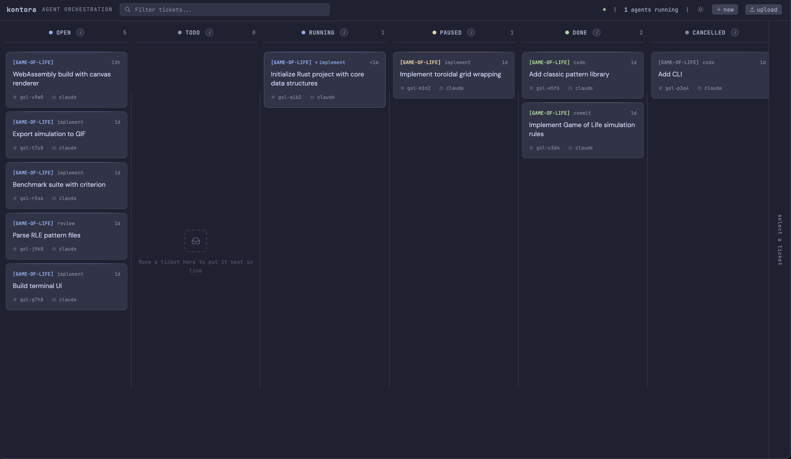
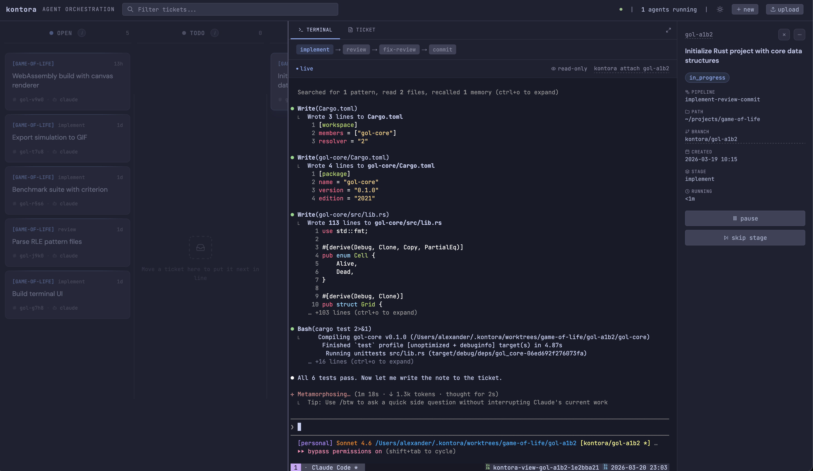

# Kontora

[](https://github.com/worksonmyai/kontora/actions/workflows/ci.yml)
[](https://goreportcard.com/report/github.com/worksonmyai/kontora)

Kontora is an agent orchestration tool. You write tickets as markdown files, it runs AI agents through multi-step pipelines, each in its own git worktree and tmux session.

<picture>
  <source media="(prefers-color-scheme: dark)" srcset="docs/dark.png">
  <source media="(prefers-color-scheme: light)" srcset="docs/light.png">
  
</picture>

<details>
<summary>tmux session view</summary>
<br>

</details>

## Features

- **Multi-stage pipelines** with per-stage retry and failure policies (implement, review, fix, commit)
- **Git worktree isolation** per ticket, so agents never conflict
- **Any agent** that has a CLI (Claude Code, Pi, etc.)
- **Web dashboard and TUI** kanban board

## Install

Ask your AI agent:

> Help me install and set up Kontora: https://raw.githubusercontent.com/worksonmyai/kontora/main/llms.txt

Or install manually:

```bash
brew tap worksonmyai/kontora https://github.com/worksonmyai/kontora
brew install kontora
```

Or build from source (requires Go 1.26+):

```bash
git clone https://github.com/worksonmyai/kontora.git
cd kontora
make install
```

## Quick start

```bash
kontora start
```

If no config exists, a setup wizard walks you through agent selection, directories, and settings, then writes `~/.config/kontora/config.yaml`.

Create a ticket:

```bash
cd ~/projects/myproject
kontora new "Add a health check endpoint"
```

Kontora picks it up, creates a git worktree, runs the agent, and marks the ticket done on success (or pauses it on failure).

Open the web dashboard at http://127.0.0.1:8080 or use the TUI:

```bash
kontora        # kanban board TUI
kontora attach # attach to the agent's tmux session
```

## Configuration

Config is stored in `~/.config/kontora/config.yaml` and defines three things: agents, stages, and pipelines.

**Agents** are binaries kontora spawns — Claude Code, Aider, or anything with a CLI:

```yaml
agents:
  claude:
    binary: claude
    args: ["--dangerously-skip-permissions", "--model", "sonnet"]
```

> [!WARNING]
> The default config runs Claude Code with `--dangerously-skip-permissions`.

**Stages** are prompt templates. They tell the agent what to do:

```yaml
stages:
  code:
    prompt: |
      {{ .Ticket.Description }}
    timeout: 30m
```

Templates use Go syntax. `{{ .Ticket.Title }}`, `{{ .Ticket.Description }}`, `{{ file "PLAN.md" }}` (reads a file from the worktree).

**Pipelines** wire stages to agents in sequence, with success/failure policies per step:

```yaml
pipelines:
  default:
    - stage: code
      agent: claude
      on_success: done
      on_failure: pause

  implement-review-commit:
    - stage: implement
      agent: claude
      on_success: next
      on_failure: pause
    - stage: review
      agent: claude
      on_success: next
      on_failure: retry
      max_retries: 1
    - stage: commit
      agent: claude
      on_success: done
      on_failure: retry
      max_retries: 1
```

Stages share a git worktree. Artifacts are passed as files — one stage writes `PLAN.md`, the next reads it via `{{ file "PLAN.md" }}`.

Full reference: [docs/configuration.md](docs/configuration.md)

## Tickets

Tickets are markdown files with YAML frontmatter, inspired by [wedow/ticket](https://github.com/wedow/ticket):

```yaml
---
id: kon-q88f
kontora: true
status: todo
pipeline: default
path: ~/projects/kontora
---
# Add GoReleaser to kontora

Automate GitHub Releases with zig cc cross-compilation.
```

Create them with `kontora new` or write them by hand. Full reference: [docs/tickets.md](docs/tickets.md)
