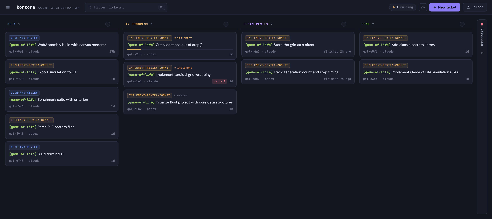
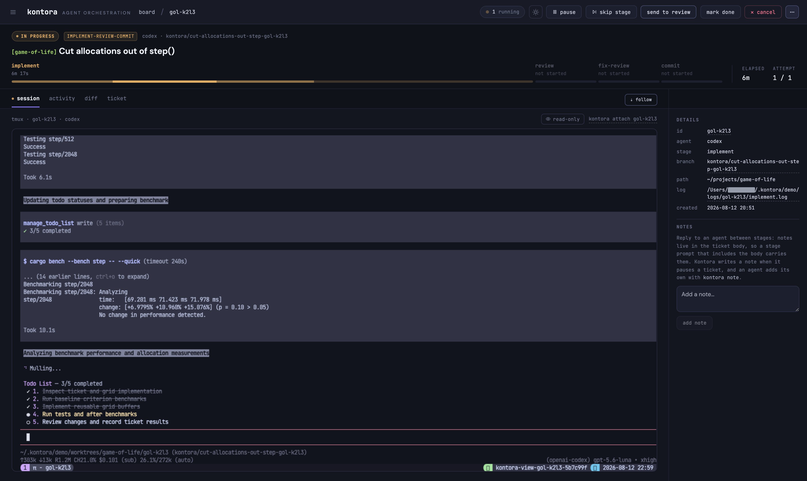

# Kontora

[](https://github.com/worksonmyai/kontora/actions/workflows/ci.yml)
[](https://goreportcard.com/report/github.com/worksonmyai/kontora)

Kontora is an agent orchestration tool. You write tickets as markdown files, it runs AI agents through multi-step pipelines, each in its own git worktree and tmux session.

<picture>
  <source media="(prefers-color-scheme: dark)" srcset="docs/dark.png">
  <source media="(prefers-color-scheme: light)" srcset="docs/light.png">
  
</picture>

<details>
<summary>ticket terminal view</summary>
<br>

</details>

## Features

- **Multi-stage pipelines** with per-stage retry and failure policies (implement, review, fix, commit)
- **Git worktree isolation** per ticket, so agents never conflict
- **Dependency-aware scheduling**: a ticket waits until every ticket it depends on is closed
- **Any agent** that has a CLI (Claude Code, Pi, etc.)
- **Web dashboard and TUI** kanban board

## Install

Ask your AI agent:

> Help me install and set up Kontora: https://raw.githubusercontent.com/worksonmyai/kontora/main/llms.txt

Or install manually:

```bash
brew tap worksonmyai/kontora https://github.com/worksonmyai/kontora
brew install kontora
```

Or build from source (requires Go 1.26+):

```bash
git clone https://github.com/worksonmyai/kontora.git
cd kontora
make install
```

What changed in each release is in [CHANGELOG.md](CHANGELOG.md).

## Quick start

Create the config:

```bash
kontora setup
```

The wizard walks you through agent selection, directories, and settings, then writes `~/.config/kontora/config.yaml`.

To have a coding agent write the config instead, run `kontora setup --agent`. It prints a brief for the agent to follow and writes nothing itself. The brief is embedded in the binary, so it describes the schema the installed version accepts. Use the same command later to add agents, stages, pipelines, or projects.

Start the daemon:

```bash
kontora start
```

Create a ticket:

```bash
cd ~/projects/myproject
kontora new "Add a health check endpoint"
```

Kontora picks it up, creates a git worktree, runs the agent, and marks the ticket done on success (or pauses it on failure).

Open the web dashboard at http://127.0.0.1:8080 or use the TUI:

```bash
kontora        # kanban board TUI
kontora attach # attach to the agent's tmux session
```

Every command, flag, and environment variable is listed in [docs/cli.md](docs/cli.md).

## Configuration

Config is stored in `~/.config/kontora/config.yaml` and defines five things: agents, stages, pipelines, projects, and hooks.

**Agents** are binaries kontora spawns — Claude Code, Aider, or anything with a CLI:

```yaml
agents:
  claude:
    binary: claude
    args: ["--dangerously-skip-permissions", "--model", "sonnet"]
```

The `args` set the model this agent runs on by default. A stage can override it.

> [!WARNING]
> The default config runs Claude Code with `--dangerously-skip-permissions`.

**Stages** are prompt templates. They tell the agent what to do, and on which model:

```yaml
stages:
  code:
    prompt: |
      {{ .Ticket.Description }}
    timeout: 30m
  commit:
    prompt: Stage, commit, and push.
    timeout: 5m
    model: haiku
```

Templates use Go syntax. `{{ .Ticket.Title }}`, `{{ .Ticket.Description }}`, `{{ file "PLAN.md" }}` (reads a file from the worktree).

**Pipelines** wire stages to agents in sequence, with success/failure policies per step:

```yaml
pipelines:
  default:
    - stage: code
      agent: claude
      on_success: human_review
      on_failure: pause

  implement-review-commit:
    - stage: implement
      agent: claude
      on_success: next
      on_failure: pause
    - stage: review
      agent: claude
      on_success: next
      on_failure: retry
      max_retries: 1
    - stage: commit
      agent: claude
      on_success: human_review
      on_failure: retry
      max_retries: 1
```

Stages share a git worktree. Artifacts are passed as files — one stage writes `PLAN.md`, the next reads it via `{{ file "PLAN.md" }}`.

**Projects** are optional. Each one names a repository and the pipeline, agent, and branch prefix that new tickets for it should default to:

```yaml
projects:
  kontora:
    path: ~/projects/kontora
    pipeline: implement-review-commit
    agent: claude
    branch_prefix: kontora
```

`kontora new --path ~/projects/kontora "..."` then writes both fields into the ticket. Pass `--pipeline none` for a standalone ticket instead.

**Hooks** run your own shell commands at lifecycle boundaries. A fresh worktree carries no gitignored files, so this is where the `.env` an agent needs comes from:

```yaml
projects:
  kontora:
    path: ~/projects/kontora
    hooks:
      worktree_created:
        - name: copy env file
          run: cp "$KONTORA_REPO_PATH/.env" .env
```

Hooks run in the worktree, get the ticket's context as `KONTORA_*` variables, and by default pause the ticket when one fails.

Full reference: [docs/configuration.md](docs/configuration.md)

## Remote mode

The CLI can drive a daemon running on another machine over the same HTTP API the web UI uses. This is meant for a trusted network such as a [Tailscale](https://tailscale.com) tailnet.

On the daemon host, bind the web server to the tailnet IP and set a shared token:

```yaml
web:
  host: 100.x.y.z   # tailnet IP, not 127.0.0.1
  port: 8080
  token: <a-long-random-secret>
```

Instead of writing the token into the config file, you can pass it to `kontora start` through the `KONTORA_WEB_TOKEN` environment variable, which overrides `web.token`. This lets a deployment inject it from a secret. It is a daemon-side setting, unrelated to the CLI's own `KONTORA_TOKEN`.

When `web.token` is set, the daemon requires it on every `/api/*` and `/ws/*` request. `GET /health` and the static UI stay public. The browser UI keeps working: open `http://<host>:8080/?token=<secret>` once and it stores a `kontora_token` cookie for subsequent API, SSE, and WebSocket calls.

From another host, point the CLI at the daemon with `KONTORA_URL` and `KONTORA_TOKEN` (or `--url`/`--token`):

```bash
export KONTORA_URL=http://100.x.y.z:8080
export KONTORA_TOKEN=<the-same-secret>

kontora ls
kontora run <id>
kontora logs <id>
kontora attach <id>   # live terminal over WebSocket
```

Remote mode needs no local config file. It supports `ls`, `view`, `new`, `init`, `update`, `delete`, `run`, `pause`, `retry`, `cancel`, `done`, `move`, `skip`, `set-stage`, `note`, `summary`, `logs`, `config`, and `attach`. Verbs that act on local files (`edit`, `archive`, `doctor`, `start`, `setup`) are rejected in remote mode. `fmt` and `completion` touch neither the daemon nor a config file, so they keep working. Configure the daemon host by running `kontora setup` there. Paths passed to `kontora new --path` refer to the daemon host's filesystem, not the caller's.

> [!WARNING]
> The token is the only thing gating remote access, and the default config runs agents with `--dangerously-skip-permissions` (effectively remote code execution). On a tailnet the transport is already encrypted, so plain HTTP is acceptable. On any untrusted network, put the daemon behind TLS (e.g. a reverse proxy) — the token alone is sent in clear over plain HTTP.

## Tickets

Tickets are markdown files with YAML frontmatter, inspired by [wedow/ticket](https://github.com/wedow/ticket):

```yaml
---
id: kon-q88f
kontora: true
status: todo
pipeline: default
path: ~/projects/kontora
---
# Add GoReleaser to kontora

Automate GitHub Releases with zig cc cross-compilation.
```

Create them with `kontora new` or write them by hand. Kontora lists any valid ticket with an `id`, but `kontora: true` is required before the daemon will execute it; otherwise the UI marks it as `not a kontora ticket`. Full reference: [docs/tickets.md](docs/tickets.md)
